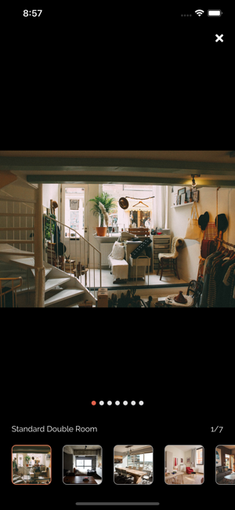

Felix React-Native App

https://apps.apple.com/us/app/felixpro/id1474371512 
https://play.google.com/store/apps/details?id=com.felixpro

  <kbd>
    
  </kbd>
  &nbsp;&nbsp;&nbsp;&nbsp;
  <kbd>
    
  </kbd>
  &nbsp;&nbsp;&nbsp;&nbsp;
  <kbd>
    
  </kbd>
    
  <kbd>
    
  </kbd>
    &nbsp;&nbsp;&nbsp;&nbsp;
  <kbd>
    
  </kbd>
      &nbsp;&nbsp;&nbsp;&nbsp;
    <kbd>
    
  </kbd>

    
  <kbd>
    
  </kbd>
    &nbsp;&nbsp;&nbsp;&nbsp;
  <kbd>
    
  </kbd>
      &nbsp;&nbsp;&nbsp;&nbsp;
    <kbd>
    
  </kbd>
    
  <kbd>
    
  </kbd>

